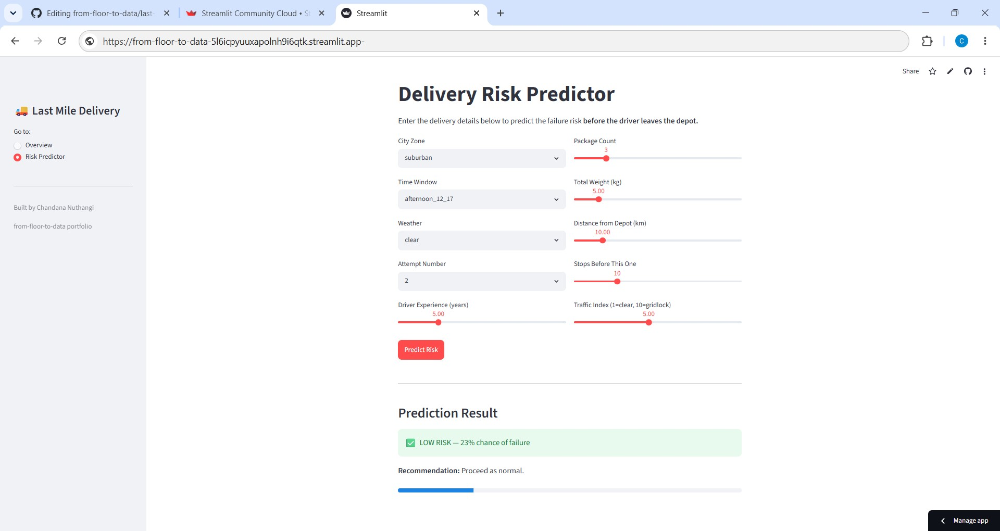

# Last Mile Delivery Analytics & Delay Predictor

> *"Predicting delivery failures before the van leaves the depot."*
## 🚀 Live Demo

[Try the interactive app here](https://from-floor-to-data-5l6icpyuuxapolnh9i6qtk.streamlit.app/)



---

## Project Overview

Last mile delivery — the final leg from depot to customer door — accounts for up to **53% of total shipping costs** and is where most failures happen. This project analyzes delivery data to understand what causes failures and delays, and builds a model to predict at-risk deliveries before dispatch.

**What makes this project different:** The features and risk factors in this dataset are grounded in real warehouse and logistics operations experience — not just textbook theory.

---

## Business Questions Answered

1. What is our overall delivery failure rate and where does it hurt most?
2. Which factors (zone, weather, time window, attempt number) drive the most failures?
3. What causes delivery delays — and how strong is the relationship with traffic?
4. Can we predict whether a delivery will fail *before* the driver sets off?

---

## Project Structure

```
last-mile-delivery/
│
├── data/
│   ├── generate_data.py          # Synthetic dataset generator
│   └── last_mile_deliveries.csv  # Generated dataset (5,000 rows)
│
├── notebooks/
│   ├── eda.py                    # Exploratory Data Analysis
│   ├── cleaning.py               # Data cleaning pipeline  (Day 2)
│   └── model.py                  # ML model                (Day 3-4)
│
├── app/
│   └── app.py                    # Streamlit dashboard      (Day 5-6)
│
├── requirements.txt
└── README.md
```

---

## Dataset

Synthetic dataset of **5,000 delivery attempts** generated with realistic operational patterns.

| Column | Description |
|---|---|
| `delivery_id` | Unique delivery identifier |
| `date` | Delivery date |
| `day_of_week` | Day name |
| `month` | Month number |
| `city_zone` | urban_core / urban_inner / suburban / rural |
| `time_window` | Requested delivery window |
| `weather` | Weather condition on delivery day |
| `attempt_number` | 1st, 2nd, or 3rd attempt |
| `driver_experience_yrs` | Years of experience |
| `package_count` | Number of packages |
| `weight_kg` | Total shipment weight |
| `distance_km` | Distance from depot |
| `stops_before_this` | How many stops driver made before this delivery |
| `traffic_index` | Traffic level 1 (clear) to 10 (gridlock) |
| `delivery_success` | **Target** — 1 = delivered, 0 = failed |
| `delay_minutes` | Minutes late (NaN if delivery failed) |

---

## Key Findings from EDA

| Finding | Value |
|---|---|
| Overall failure rate | ~40% |
| Worst zone | Urban core (44.6% failure) |
| Worst time window | "Anytime" slot (48% failure) |
| Snow vs clear weather delay | 47 min vs 22 min average |
| 3rd attempt failure rate | 54.9% |
| Strongest delay predictor | Traffic index (r = 0.478) |

---

## Tools & Technologies

- **Python** — pandas, numpy, scikit-learn
- **Visualization** — matplotlib, seaborn
- **ML** — scikit-learn (Random Forest, Logistic Regression)
- **App** — Streamlit
- **Environment** — Google Colab + Google Drive

---

## How to Run

### Option 1 — Google Colab (recommended)

1. Open each `.py` file in Google Colab
2. Mount your Google Drive when prompted
3. Run cells top to bottom

### Option 2 — Local

```bash
git clone https://github.com/chandana-nuthangi/last-mile-delivery
cd last-mile-delivery
pip install -r requirements.txt
python data/generate_data.py
python notebooks/eda.py
```

---

## About

Built by **Chandana Nuthangi** as part of the [from-floor-to-data](https://github.com/chandana-nuthangi) portfolio —
combining hands-on warehouse operations experience at Amazon and Kuehne+Nagel with data science skills.

The risk factors modeled here (zone difficulty, time window vagueness, driver fatigue from stop count) reflect real patterns observed on the warehouse and logistics floor — not just assumptions from documentation.

---

